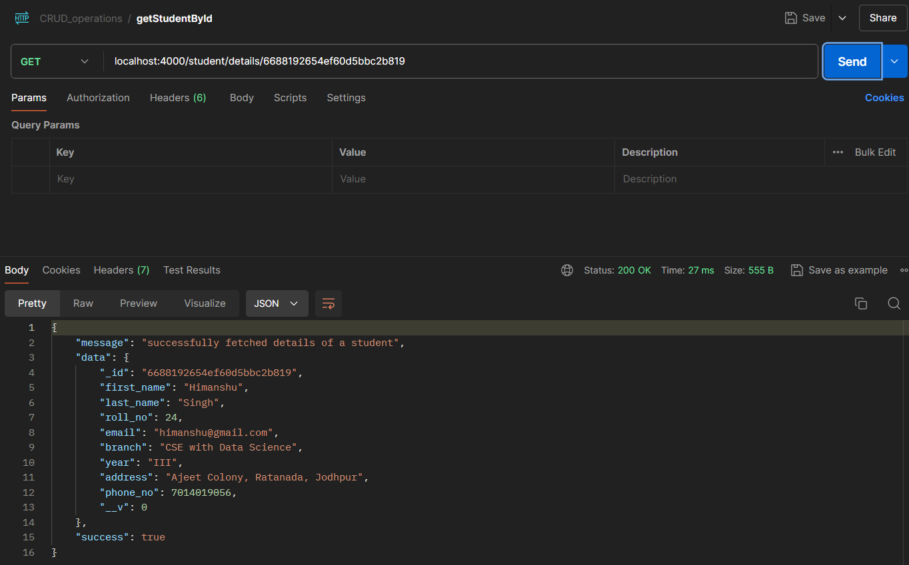

## CSI_5th_Assignment(NodeJs)
### "CRUD application with MongoDB" 

#### Student Management System
- This project is a simple CRUD (Create, Read, Update, Delete) application for managing student details using Node.js, Express, and MongoDB.

- Setup Instructions:
    - Clone the repository to your local machine.
    - Navigate to the project directory.
    - Install the required dependencies: `npm install`
    - Create a `.env` file in the project root with the following content: 
        - `PORT=your_port_number`
        - `MONGODB_URL=your_mongodb_connection_string`

- Routes:
*POST* `/student/details`: Adds a new student.
*GET* `/student/details`: Fetches details of all students.
*GET* `/student/details/:student_id`: Fetches details of a specific student by ID.
*PATCH* `/updatestudent/:student_id`: Updates details of a specific student by ID.
*DELETE* `/deletestudent/:student_id`: Deletes a specific student by ID.

- Running the Application:
    - Start the server: `npm start`
    - The server will run on the port specified in the `.env` file and connect to the MongoDB instance specified in the `MONGODB_URL`

